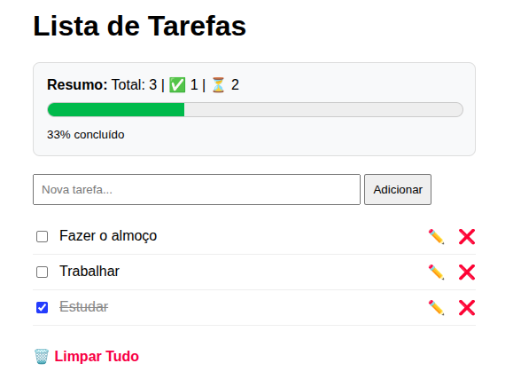

# To-Do List com Flask e SQLite

Este é um projeto de lista de tarefas desenvolvido em Python usando Flask e SQLAlchemy.

## Funcionalidades

* Adicionar, editar e excluir tarefas.
* Barra de progresso dinâmica baseada em tarefas concluídas.
* Persistência de dados com SQLite.

## Demonstração

